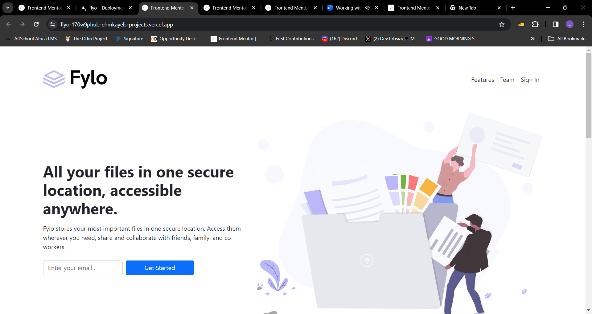
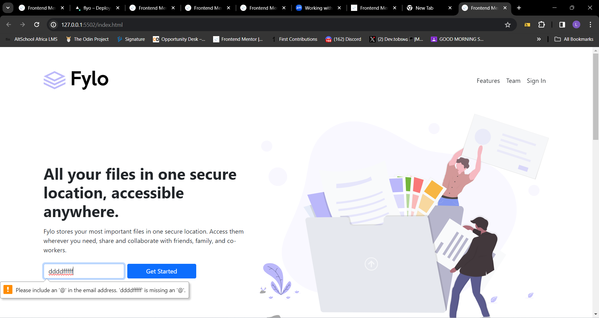
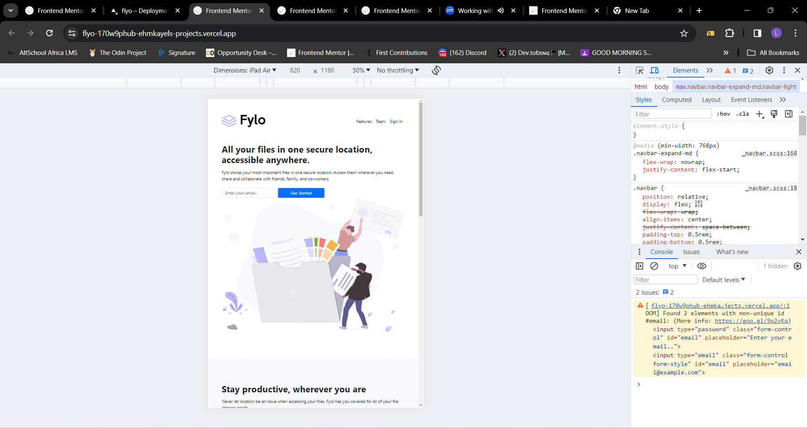

# Frontend Mentor - Fylo landing page with two column layout solution

This is a solution to the [Fylo landing page with two column layout challenge on Frontend Mentor](https://www.frontendmentor.io/challenges/fylo-landing-page-with-two-column-layout-5ca5ef041e82137ec91a50f5). Frontend Mentor challenges help you improve your coding skills by building realistic projects. 

## Table of contents

- [Overview](#overview)
  - [The challenge](#the-challenge)
  - [Screenshot](#screenshot)
  - [Links](#links)
- [My process](#my-process)
  - [Built with](#built-with)
  - [Useful resources](#useful-resources)
- [Author](#author)

## Overview

### The challenge

Users should be able to:

- View the optimal layout for the interface depending on their device's screen size
- See hover and focus states for all interactive elements on the page

### Screenshot

### Links

- Solution URL: [Code](https://github.com/Ehmkayel/Flyo)
- Live Site URL: [Flyo landing page](https://flyo-cyan.vercel.app/)

## My process
- I firstly downloaded the starter pack from [FrontendMentor](https://www.frontendmentor.io/challenges/fylo-landing-page-with-two-column-layout-5ca5ef041e82137ec91a50f5);
- Then I opened the file on my system and installed [bootstrap](https://blog.getbootstrap.com/2023/05/30/bootstrap-5-3-0/);
- I previewed all the designs and I started building
- After building I pushed to github and deployed with vercel

### Built with

- Semantic HTML5 markup
- css variables
- Bootstrap
- Css custom properties

### Useful Resources

- Bootstrap documentation [@bootstrap](https://blog.getbootstrap.com/2023/05/30/bootstrap-5-3-0/)

- Vercel for deployment [@vercel](vercel.com/signup)

## Author
- Frontend Mentor - [@Ehmkayel](https://www.frontendmentor.io/profile/Ehmkayel)
- Twitter - [@kamalehmk](https://www.twitter.com/kamalehmk)

